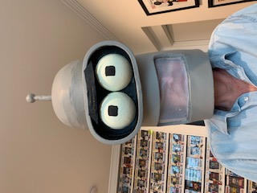
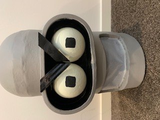
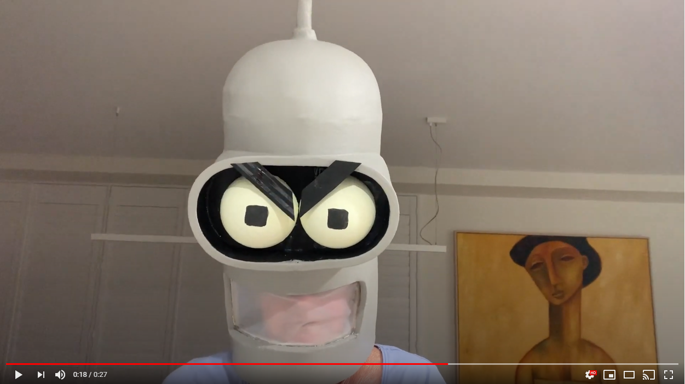

# *Moving Eyelids Costume Head*
## *Jess Fisher-Kappen s5080247* ##
## 1701QCA Making Interaction 2020 Final Project ##

<!--- When you have completed the template, submit the link to the GitHub Pages site for this repository as a link in Learning@Griffith. The link should be something like [https://qcainteractivemedia.github.io/1701QCA-Assessment3/](https://qcainteractivemedia.github.io/1701QCA-Assessment3/) where `qcainteractivemedia` is replaced with your GitHub username and `1701QCA-Assessment3` is replaced with whatever you called the repository this template is contained in when you set it up. You should NOT be submitting a link that begins with github.com/[your user name] as that is not the rendered version. See the instructions about creating GitHub pages to see how to get the link to the rendered page. --->

<!--- PROJECT DESCRIPTION: In a few sentences, describe what the project is and does, who it is for, and a typical use case. This should be suitable for a catalog, poster, or other display material about the project. --->
This is a wearable head designed for fans of cosplay (costume play) that want an interactive costume. The eyelids just above the robot's eyes are able to move up and down, demonstrating that the robot is angry. This is triggered by the user tilting their head forward or by bowing. When this is worn at conventions and other gathering,   

### Journal ###
[Process and reflection journal](/journal/journal.md)
