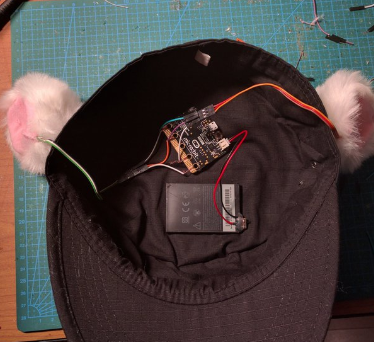
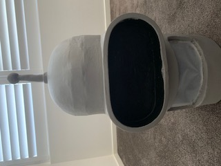
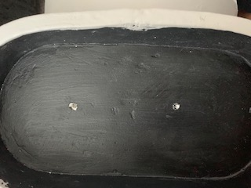
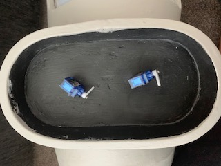
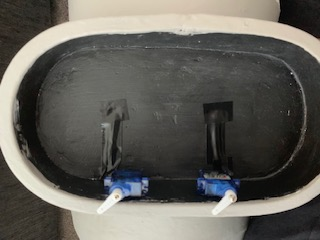
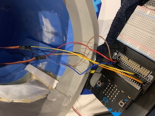
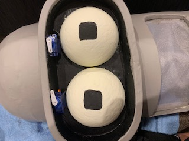

# 1701QCA Final project journal: *Jess Fisher-Kappen*

## Related projects ##

### *Mechatronic Ears on the microbit* ###

[Mechatronic Ears on the microbit](https://hackaday.io/project/18758-mechatronic-ears-on-the-microbit)

This is quite interesting as it also uses a microbit to make a component of the hat movable, and is able to disguise the wires. 

### *Halloween + Microbit* ###

[Halloween + Microbit](https://www.instructables.com/id/Halloween-Microbit/)

This is a fun project that incorporates lights and LED usage with the microbit instead of using the accelerometer. 

### *No face animatronic mouth* ###

[No face animatronic mouth](https://www.youtube.com/watch?v=kjxdWnUBmpU)

This project also uses some form of animatronics to work and the costume interacts with users.

### *Haunted Mansion Portrait Moving T-shirt* ###

[Haunted Mansion Portrait Moving T-shirt](https://www.morphsuits.com/haunted-mansion-portrait-t-shirt-us)

Although quite simple, this shirt is something that is engaging and can interact with onlookers. 

## Other research ##
https://www.youtube.com/channel/UCiDJtJKMICpb9B1qf7qjEOA
Adam Savage's Tested Youtube channel was a very interesting and informative channel with lots of unique, creative videos. I saw some ideas, and although his costumes would be very hard to replicate, it was still interesting learning how his thought process worked.

## Conceptual development ##

### Design intent ###
I would like to make a costume that can interact with its surroundings instead of just being static like a lot of the costumes that are currently available.

### Design ideation ###
Design concept 1
A costume with a light attached to it. When someone comes too close to you, the light turns on and starts flashing, and a beeping sound will slowly start to be projected. The closer someone gets, the faster the beeping becomes.

Design concept 2
A costume that cools you down. It gets hot in costumes, and when the temperature in costumes reaches certain degrees, a fan would automatically turn on.

### Final design concept ###
A costume that has facial expressions. You would be able to control it so that it can portray different emotions such as happy or sad. I like the idea of recreating Bender from Futurama with EVA foam for the head and styrofoam for the eyes. It would need to look sleek and not have any wires showing, so there would need to be a compartment in the head.

### Interaction flowchart ###

## Process documentation ##

#### Assignment 2 process documentation ####
I have started to develop an interest in costumes that serve a greater purpose than just someone wearing the costume. I've noticed a greater demand in people wanting interactive/moving costumes to greater recreate the person/character that they are costuming. People either don't know how to make the costume more interactive, or they pay someone else a lot of money to create it for them. While doing some research, I had noticed a lot of people that make costumes use a material called EVA foam as it was lightweight but still created something that could look realistic.

#### Improving the project ####
For some reason the servo arms weren't starting at 90 degrees to the servo base so I had to double check the arm position by quickly altering it. After some fiddle work with the servo, I got both arms to start in the position I had wanted. Occasionally the arms would move to a different angle, but then managed to reset back to the correct starting position after a few seconds.  

#### Trying to add sound to the project ####
As documented in assignment 2, I was struggling to get the sound to come out of the speaker as well as have the 2 servos working correctly. I successfully managed to get sound coming out of the speaker eventually by changing the pins of the servos. However, that then resulted in the servos not following the 'instructions' I had set and instead kept getting stuck at odd angles. I then had to make the decision to omit sound from this project. 

#### Photographic progress ####

This is the head with the finished grey paint on it. 

I then had to put two holes in the eye area so that the wires could stick through.

Once the holes were big enough, the servo wires were threaded through

The wires were then taped to hide the wires, and also protect it from the glue. 

These are the wires that were going inside the head. 

The eyes were then glued into place. 

## Final code ##

## Design process discussion ##
<!--- Discuss your process used in this project, particularly with reference to aspects of the Double Diamond design methodology or other relevant design process. --->
My focus was to make a costume that, although simple, was able to be interactive with observers by choice of the person wearing the costume. The design was fairly simple as I wanted to recreate the head of a famous robot from the show 'Futurama', named Bender. A lot of people making static costumes suggested EVA foam to help with the cost aspect of materials as well as the weight. 

## Reflection ##
Using EVA foam was super helpful in keeping the costume light and function at the same time. It was also fairly affordable. Having a heat gun, as suggested from one of the related projects, was very important as well as I feel like if I didn't have one, I would not have been able to make the shape of Bender's head, along with keeping him a cylindrical shape. However, I had hoped that I could add sound to the final project as I believed it would make for a more interesting and fun interaction. 

The part of the project that I feel is novel is that it is interactive with the user depending on how the wearer of the costume head moves. 

The project can be further extended by including different facial expressions, adding sound and lighting and having more interactive components in the body of the costume. This head is only the beginning of the costume, and can be applied to many different parts of a whole body costume.  
