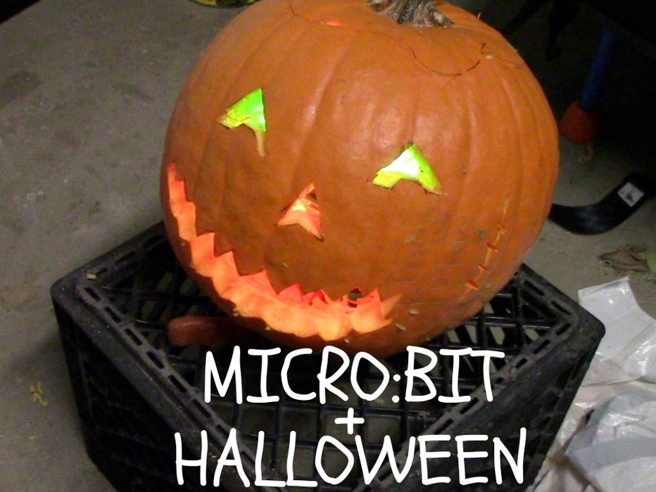
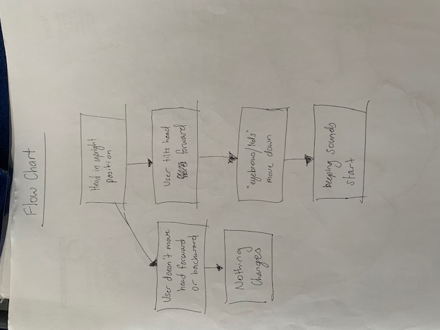
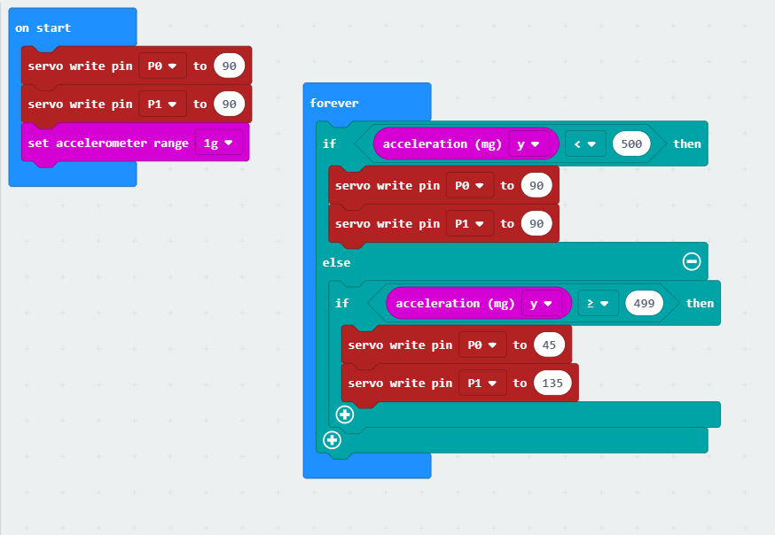

# 1701QCA Final project journal: *Jess Fisher-Kappen*

<!--- As for other assessments, fill out the following journal sections with information relevant to your project. --->

<!--- Markdown reference: https://guides.github.com/features/mastering-markdown/ --->

## Related projects ##
<!--- Find about 6 related projects to the project you choose. A project might be related through  function, technology, materials, fabrication, concept, or code. Don't forget to place an image of the related project in the appropriate folder and insert the filename in the appropriate places below. Copy the markdown block of code below for each project you are showing. --->

### *Mechatronic Ears on the microbit* ###

<!--- Modify code to insert image of related project below --->

<!--- Fill out name and link to related project in the code below. --->
[Mechatronic Ears on the microbit](https://hackaday.io/project/18758-mechatronic-ears-on-the-microbit)
<!--- Include information about why this project is related to yours. --->

<!--- Repeat code above for a total of 6 related projects --->

### *Halloween + Microbit* ###

<!--- Modify code to insert image of related project below --->

<!--- Fill out name and link to related project in the code below. --->
[Halloween + Microbit](https://www.instructables.com/id/Halloween-Microbit/)

<!--- Include information about why this project is related to yours. --->

<!--- Repeat code above for a total of 6 related projects --->

### *Insert name of related project here* ###

<!--- Modify code to insert image of related project below --->

<!--- Fill out name and link to related project in the code below. --->
[Name of related project](https://[URL of related project])

<!--- Include information about why this project is related to yours. --->

<!--- Repeat code above for a total of 6 related projects --->

### *Insert name of related project here* ###

<!--- Modify code to insert image of related project below --->

<!--- Fill out name and link to related project in the code below. --->
[Name of related project](https://[URL of related project])

<!--- Include information about why this project is related to yours. --->

<!--- Repeat code above for a total of 6 related projects --->

### *Insert name of related project here* ###

<!--- Modify code to insert image of related project below --->

<!--- Fill out name and link to related project in the code below. --->
[Name of related project](https://[URL of related project])

<!--- Include information about why this project is related to yours. --->

<!--- Repeat code above for a total of 6 related projects --->

### *Insert name of related project here* ###

<!--- Modify code to insert image of related project below --->

<!--- Fill out name and link to related project in the code below. --->
[Name of related project](https://[URL of related project])

<!--- Include information about why this project is related to yours. --->

<!--- Repeat code above for a total of 6 related projects --->

## Other research ##
<!--- Include here any other relevant research you have done. This might include identifying readings, tutorials, videos, technical documents, or other resources that have been helpful. For each particular source, add a comment or two about why it is relevant or what you have taken from it. You should include a reference or link to each of these resources. --->

## Conceptual development ##

### Design intent ###
I would like to make a costume that can interact with its surroundings instead of just being static like a lot of the costumes that are currently available.

### Design ideation ###
Design concept 1
A costume with a light attached to it. When someone comes too close to you, the light turns on and starts flashing, and a beeping sound will slowly start to be projected. The closer someone gets, the faster the beeping becomes.

Design concept 2
A costume that cools you down. It gets hot in costumes, and when the temperature in costumes reaches certain degrees, a fan would automatically turn on.

### Final design concept ###
A costume that has facial expressions. You would be able to control it so that it can portray different emotions such as happy or sad. I like the idea of recreating Bender from Futurama with EVA foam for the head and styrofoam for the eyes. It would need to look sleek and not have any wires showing, so there would need to be a compartment in the head.

### Interaction flowchart ###
<!--- Include an interaction flowchart of the interaction process in your project. Make sure you think about all the stages of interaction step-by-step. Also make sure that you consider actions a user might take that aren't what you intend in an ideal use case. Insert an image of it below. It might just be a photo of a hand-drawn sketch, not a carefully drawn digital diagram. It just needs to be legible. --->

## Process documentation ##
<!--- In this section, include text and images (and potentially links to video) that represent the development of your project including sources you've found (URLs and written references), choices you've made, sketches you've done, iterations completed, materials you've investigated, and code samples. Use the markdown reference for help in formatting the material.

#### Assignment 2 process documentation ####
I have started to develop an interest in costumes that serve a greater purpose than just someone wearing the costume. I've noticed a greater demand in people wanting interactive/moving costumes to greater recreate the person/character that they are costuming. People either don't know how to make the costume more interactive, or they pay someone else a lot of money to create it for them. While doing some research, I had noticed a lot of people that make costumes use a material called EVA foam as it was lightweight but still created something that could look realistic.

#### Improving the project ####

#### Trying to add sound to the project ####

There will likely by a dozen or so images of the project under construction. The images should help explain why you've made the choices you've made as well as what you have done. --->

## Final code ##

## Design process discussion ##
<!--- Discuss your process used in this project, particularly with reference to aspects of the Double Diamond design methodology or other relevant design process. --->

## Reflection ##

<!--- Describe the parts of your project you felt were most successful and the parts that could have done with improvement, whether in terms of outcome, process, or understanding.

What techniques, approaches, skills, or information did you find useful from other sources (such as the related projects you identified earlier)?

What parts of your project do you feel are novel. This is IMPORTANT to help justify a key component of the assessment rubric.
The part of the project that I feel is novel is 

What might be an interesting extension of this project? In what other contexts might this project be used? --->
The project can be further extended by including different facial expressions, adding sound and lighting and having more interactive components in the body of the costume.  
